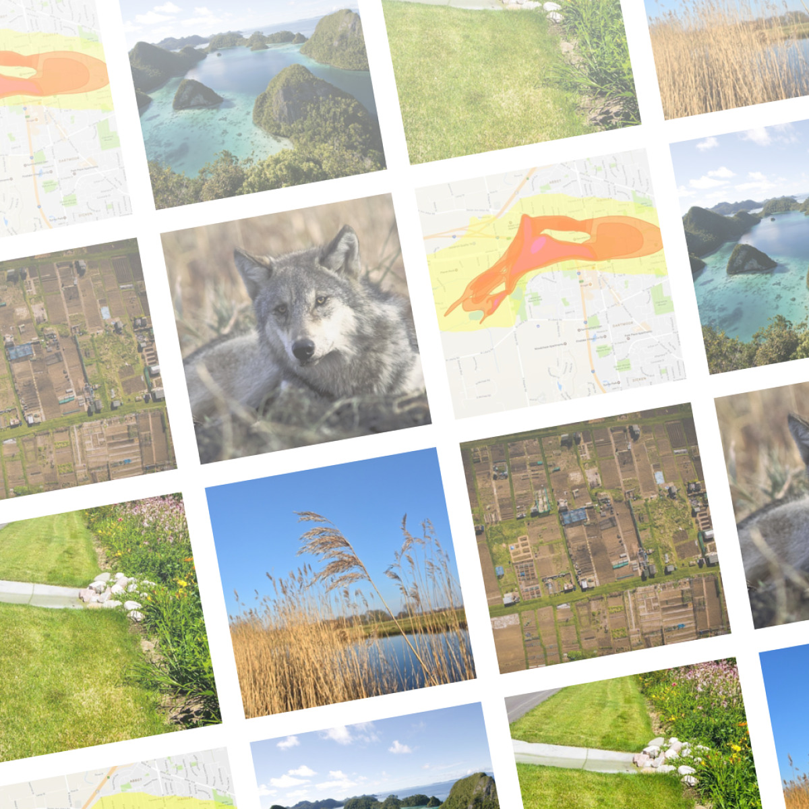

# CaseGrid

## License

The gem is available as open source under the terms of the [MIT License](https://opensource.org/licenses/MIT).

## Code of Conduct

Everyone interacting in the CaseGrid project’s codebases, issue trackers, chat rooms and mailing lists is expected to follow the [code of conduct](CODE_OF_CONDUCT.md).
